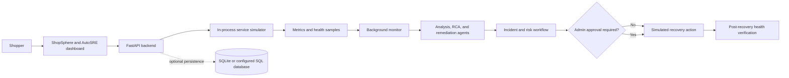

# AutoSRE: Autonomous Multi-Agent Incident Management and Recovery Platform

AutoSRE is a service-monitoring and incident-management demo. It detects health and telemetry anomalies, investigates likely causes, recommends recovery actions, and verifies recovery. Bounded actions can run automatically; higher-risk actions wait for administrator approval. The demo is integrated with ShopSphere, an Indian e-commerce storefront backed by logical, simulated services.

## Key features

- Continuous health and telemetry monitoring while the backend process is running
- Incident, alert, log, and service views with an investigation timeline
- A staged, rule-based agent workflow for analysis, root-cause classification, and remediation
- Risk-bounded automatic recovery, administrator approval for higher-risk actions, and post-action health checks
- ShopSphere storefront, account flows, cart, and order demonstration

## Architecture



The FastAPI process, monitor, incident workflow, and service simulator are real application code. The e-commerce microservices and recovery operations are simulated in-process; this repository does not operate Kubernetes, cloud infrastructure, or a payment gateway.

## Technology

- **Frontend:** React, Vite, React Router, Recharts, Lucide
- **Backend:** Python, FastAPI, Uvicorn, SQLAlchemy
- **Storage:** SQLite locally by default; PostgreSQL is supported through `DATABASE_URL`. Database-free demo mode uses temporary in-memory accounts and incident data.
- **Tests:** Python `unittest`, FastAPI `TestClient`, HTTPX; frontend ESLint and Vite build scripts
- **Hosting:** Vercel frontend and Render API

## Project structure

```text
.
├── backend/                 # FastAPI app, agents, services, tests, Python dependencies
├── dashboard/               # React/Vite frontend (Vercel project root)
├── docs/                    # Architecture notes
├── main.py                  # Render-compatible entry point
├── requirements.txt         # Render-compatible include of backend dependencies
└── README.md
```

The frontend directory remains named `dashboard/` to match the existing Vercel root-directory setting.

## Getting started

Use Python 3.10 or newer and Node.js with npm.

```powershell
git clone https://github.com/abhivadiyala26/Self-Evolving-Software-Assistant-.git
cd Self-Evolving-Software-Assistant-
python -m pip install -r backend/requirements-dev.txt
python -m uvicorn backend.app:app --reload --port 8000
```

In a second terminal:

```powershell
cd dashboard
npm ci
Copy-Item .env.example .env.local
npm run dev
```

The UI runs at `http://localhost:5173`; the API runs at `http://localhost:8000`. Vite loads `.env.local` automatically. Set `VITE_API_BASE_URL` to the backend origin, without `/api`.

## Configuration

Use `dashboard/.env.example` as the Vite environment template. Backend values in `backend/.env.example` are safe references for process variables; the app does not load a `.env` file itself. Set values in your shell, IDE, or hosting provider. The backend creates `data/autosre.db` locally by default. Set `DATABASE_URL` (or `AUTOSRE_DATABASE_URL`) for durable database-backed accounts and orders, and set `AUTOSRE_CORS_ORIGINS` to the exact frontend origins. For a private admin account, configure `AUTOSRE_ADMIN_EMAIL` and a private `AUTOSRE_ADMIN_PASSWORD` of at least 12 characters.

## Authentication and demo limits

Admin access uses a separate backend role and server-checked session; normal users cannot access admin APIs. On the deployed Render service, public demo credentials are exposed through the login suggestions only when no `DATABASE_URL` is configured. They are intentionally public demo accounts, not private administrator credentials. Signup accounts, incidents, telemetry, logs, and alerts are temporary in database-free mode and reset when the backend restarts. Persistent account and order storage requires a configured database. Payments and service recovery remain simulated.

## Tests

From the repository root:

```powershell
python -m unittest discover -s backend/tests -v
```

The backend regression suite covers registration, role isolation, sessions, database-free demo auth, order persistence and retry behavior, and recovery policy. Frontend checks are run from `dashboard/` with `npm run lint` and `npm run build`.

## Deployment

The existing Vercel project uses `dashboard/` as its root. Render uses the repository root with `pip install -r requirements.txt` and `uvicorn main:app --host 0.0.0.0 --port $PORT`. The root entry point and requirements include preserve those commands while application code lives under `backend/`. Set Vercel's `VITE_API_BASE_URL` to the Render API origin and configure `AUTOSRE_CORS_ORIGINS` on Render to include the frontend origin. Host status is not verified by this repository change.

## Limitations

Logical services, telemetry, and recovery actions are demonstrations rather than integrations with live infrastructure. Database-free state is ephemeral.

## Future improvements

Potential next steps include durable incident analytics, richer observability, and adapters for real infrastructure with explicit safety controls.

See [docs/architecture.md](docs/architecture.md), [backend/README.md](backend/README.md), and [dashboard/README.md](dashboard/README.md) for implementation details.
